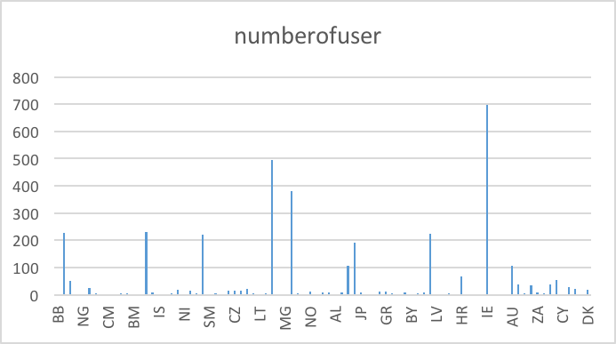

# ica4

## Description of strata_user.airbnb_sq
Table contains the information about data, number of search, price,neighborhood, host original countries etc every user searches.


## Question 1
How many users from US are going to live more than 4 nights?

```sql
select 
n_nights, origin_country,
count(id_user) as usernumber
from datasets.airbnb_searches
where n_nights > 4 AND origin_country='US'
group by 1,2
```


## Question 2
How many people filter room type for private room and could accept the max. price over 500?

```sql
select 
filter_room_types,filter_price_max,
count(id_user) as usernumber
from datasets.airbnb_searches
where filter_room_types='Private room'and filter_price_max > 500
group by 1,2
```


## Question 3
Which origin countries are people search for more than 7 days?

```sql
select 
origin_country,
count(id_user) as numberofuser
from datasets.airbnb_searches
where n_nights> 7
group by 1
```



## Question 4
How many search appeared in 2014?

```sql
SELECT 
ds,n_searches
FROM datasets.airbnb_searches
WHERE ds between '2014-01-01' AND '2014-12-31'
```


## Question 5
How many users are required min guests for 2 from US?

```sql
select 
n_guests_min, origin_country,
count(id_user) as numberofuser
from datasets.airbnb_searches
where n_guests_min=2 AND origin_country='US'
group by 1,2
```


